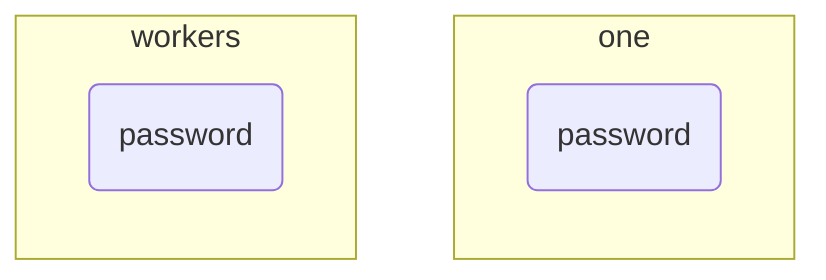

# janus.js
Janus javascript implementation

```mermaid
flowchart TD
    id1(((This is the text in the circle)))
    subgraph one
        id1(password)
    end
    subgraph workers
        id2(password)
    end

```
